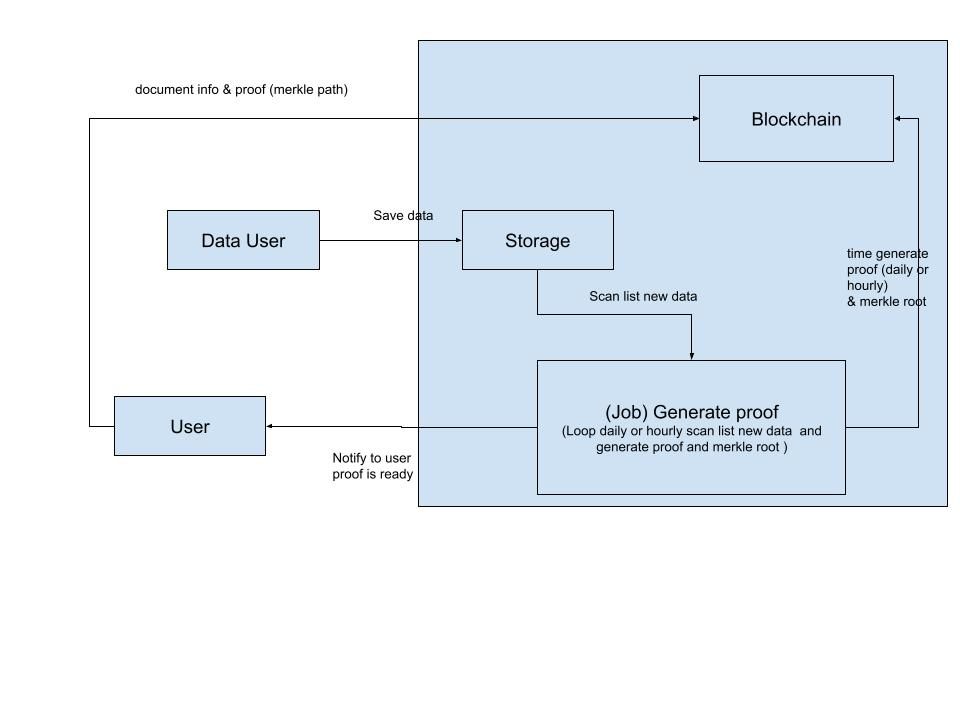
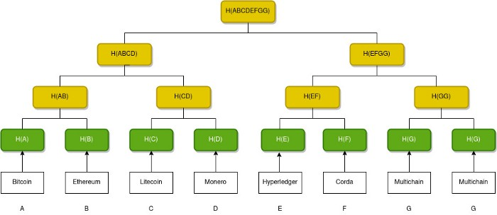

### Generate Proof flow

### Merkle Path / Merkle Proof
[Merkle Path / Merkle Proof](https://harshil.dev/writings/understanding-merkle-proof#merkle-proof)

A Merkle path for a leaf in a Merkle tree is the smallest number of additional nodes in the tree required to compute the root hash.
In this example, we required 3 additional nodes to calculate the root hash. So the Merkle path for H(E) is H(F), H(GG), H(ABCD).
